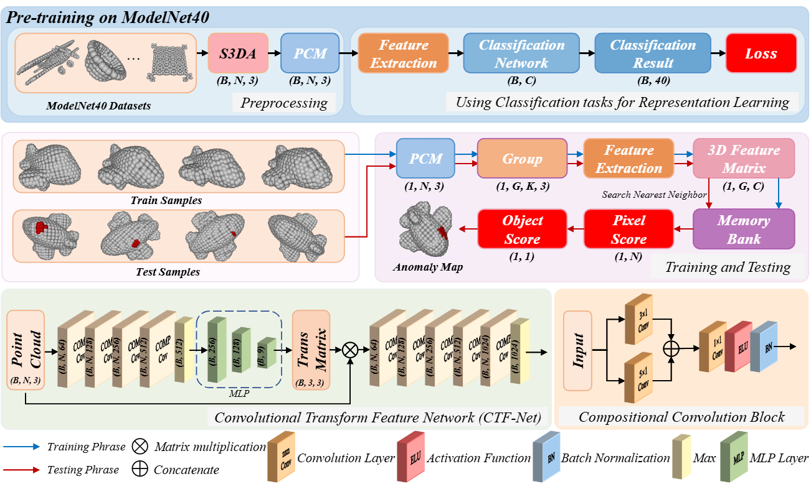

# RIF
This is the official implementation of the paper "A Lightweight 3D Anomaly Detection Method with Rotationally Invariant". This work has been submitted for review to ‘Advanced Engineering Informatics’. 



You can visit paper at [link](https://github.com/hzzzzzhappy/RIF/blob/main/docs/paper.pdf).
## Datasets and Pretrain
We use [Real3d-ad](https://github.com/m-3lab/real3d-ad) and [Anomaly-ShapeNet](https://github.com/Chopper-233/Anomaly-ShapeNet) for evluation.

Navigate to the training directory and run the training scripts for pre-training:
```
cd train
./train  # Execute training scripts
```
The training files contain the complete pre-training pipeline

## Run
You need run
```
python3 main.py --gpu 0 --seed 42 --memory_size 10000 --anomaly_scorer_num_nn 1 --faiss_on_gpu --faiss_num_workers 8 sampler -p 0.1 approx_greedy_coreset
```
